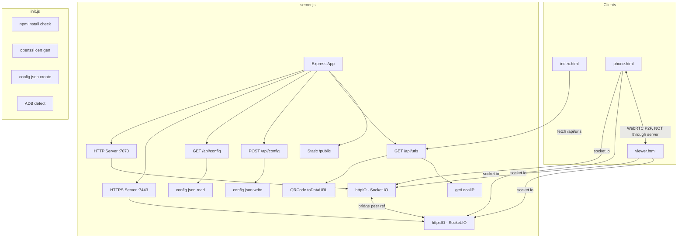
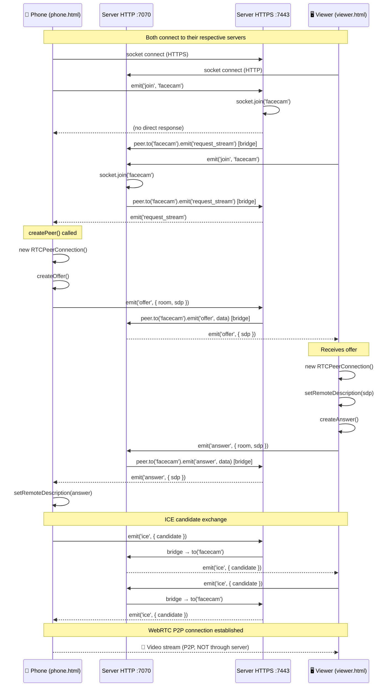
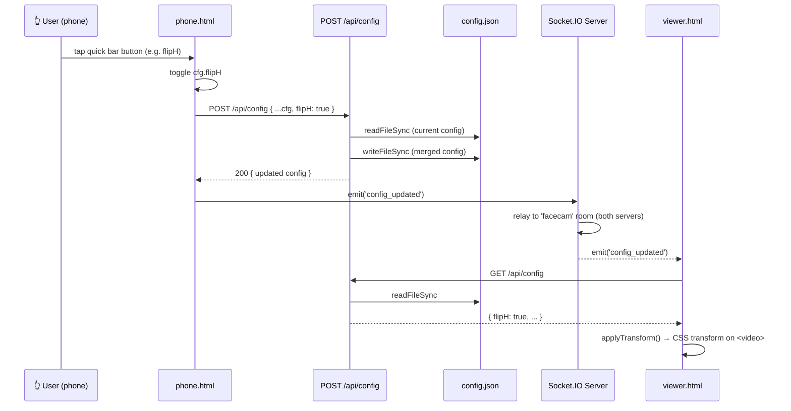
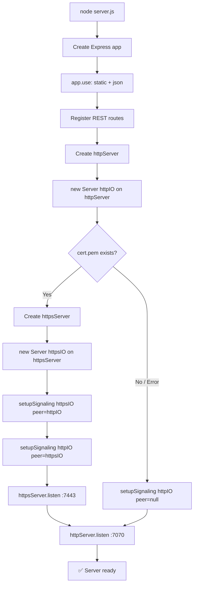
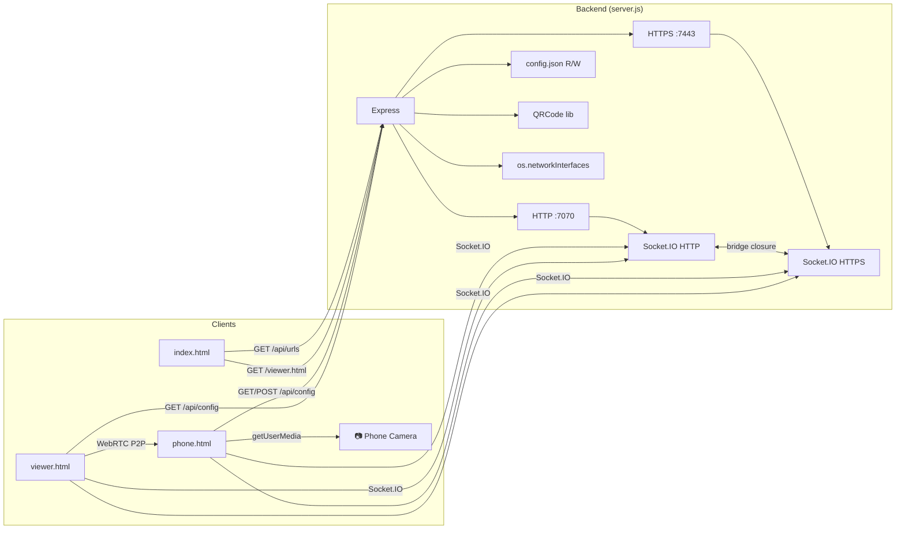

# FaceCam Server — Architecture Audit

> **Auditor:** Principal Engineer Review  
> **Date:** 2026-06-22  
> **Scope:** Full codebase — `server.js`, `init.js`, `public/` (3 HTML/JS files), `config.json`  
> **Style:** Production-grade audit — no summaries, full execution trace

---

## Table of Contents

1. [Project Overview](#1-project-overview)
2. [File & Module Inventory](#2-file--module-inventory)
3. [Architecture Style Classification](#3-architecture-style-classification)
4. [Dependency Graph](#4-dependency-graph)
5. [Feature-by-Feature Breakdown](#5-feature-by-feature-breakdown)
   - 5.1 [Server Boot & HTTPS Initialization](#51-server-boot--https-initialization)
   - 5.2 [QR Code Generation & URL API](#52-qr-code-generation--url-api)
   - 5.3 [Config Read/Write API](#53-config-readwrite-api)
   - 5.4 [WebRTC Signaling (Offer/Answer/ICE)](#54-webrtc-signaling-offeranswerice)
   - 5.5 [Phone Camera Stream](#55-phone-camera-stream)
   - 5.6 [Viewer (PC) Receive Stream](#56-viewer-pc-receive-stream)
   - 5.7 [Quick Bar & Config Sync](#57-quick-bar--config-sync)
   - 5.8 [Cross-Server Bridge (HTTP↔HTTPS)](#58-cross-server-bridge-httphttps)
   - 5.9 [Phone Disconnect Notification](#59-phone-disconnect-notification)
   - 5.10 [Viewer Keep-Alive](#510-viewer-keep-alive)
   - 5.11 [Init & Setup Script](#511-init--setup-script)
6. [Use-Case Catalog](#6-use-case-catalog)
7. [System Flow Diagrams](#7-system-flow-diagrams)
   - 7.1 [Full WebRTC Signaling Flow](#71-full-webrtc-signaling-flow)
   - 7.2 [Config Update Flow](#72-config-update-flow)
   - 7.3 [Server Boot Flow](#73-server-boot-flow)
   - 7.4 [Component Dependency Graph](#74-component-dependency-graph)
8. [Risk Analysis](#8-risk-analysis)
   - 8.1 [Race Conditions](#81-race-conditions)
   - 8.2 [Concurrency Risks](#82-concurrency-risks)
   - 8.3 [Memory Leak Risks](#83-memory-leak-risks)
   - 8.4 [Security Issues](#84-security-issues)
   - 8.5 [Scalability Bottlenecks](#85-scalability-bottlenecks)
9. [Code Quality Analysis](#9-code-quality-analysis)
   - 9.1 [Dead Code](#91-dead-code)
   - 9.2 [Duplicated Logic](#92-duplicated-logic)
   - 9.3 [God Objects](#93-god-objects)
   - 9.4 [Business Logic Leakage](#94-business-logic-leakage)
   - 9.5 [Missing Boundaries](#95-missing-boundaries)
10. [Architecture Quality Scores](#10-architecture-quality-scores)
11. [Refactor Recommendations](#11-refactor-recommendations)
12. [Final Verdict](#12-final-verdict)

---

## 1. Project Overview

FaceCam Server is a **real-time video streaming relay** that turns a mobile phone into a webcam via WebRTC. The architecture is intentionally minimal: a Node.js signaling server bridges the WebRTC handshake between a phone (sender) and a PC browser/OBS (receiver). Actual video data travels **peer-to-peer** — never through the Node.js process.

**Technology stack:**
| Layer | Technology |
|---|---|
| Runtime | Node.js 16+ |
| HTTP Framework | Express 5.x |
| Real-time | Socket.IO 4.x (over both HTTP and HTTPS) |
| Transport | WebRTC (browser-native, P2P) |
| TLS | Self-signed cert via OpenSSL |
| QR | `qrcode` npm package |
| Frontend | Vanilla JS, no build step |
| Config | JSON file on disk |
| Database | None |
| Auth | None |
| Queue | None |
| Cache | None |

---

## 2. File & Module Inventory

```
facecamserver/
├── server.js           ← Single-file backend: HTTP, HTTPS, Socket.IO, Express routes, signaling logic
├── init.js             ← One-time setup CLI: npm install, OpenSSL cert generation, config.json creation, ADB check
├── package.json        ← Dependencies: express, qrcode, socket.io
├── config.json         ← Mutable runtime config: flipH, flipV, rotation, hideControls, phone camera settings
├── cert.pem            ← Self-signed TLS cert (gitignored, generated by init.js)
├── key.pem             ← TLS private key (gitignored, generated by init.js)
└── public/
    ├── index.html      ← PC dashboard: shows QR codes for USB/WiFi modes
    ├── phone.html      ← Mobile sender: getUserMedia → WebRTC offer → stream
    └── viewer.html     ← PC receiver: WebRTC answer → <video> display → OBS source
```

**Line counts (excluding node_modules):**

| File | Lines | Responsibility |
|---|---|---|
| `server.js` | 146 | Everything backend |
| `init.js` | 110 | One-time setup |
| `public/index.html` | ~100 | QR dashboard |
| `public/phone.html` | ~320 | Mobile camera UI + WebRTC sender |
| `public/viewer.html` | ~188 | PC receiver UI + WebRTC answer |

---

## 3. Architecture Style Classification

### Classification: **Monolithic Single-File + Flat Client Scripts**

This is not Clean Architecture, Hexagonal, or CQRS. It is a **pragmatic single-concern relay server** — appropriate for its scope. The architecture can be described as:

```
┌─────────────────────────────────────────────┐
│              server.js (monolith)           │
│                                             │
│  ┌──────────┐  ┌──────────┐  ┌──────────┐  │
│  │  Express │  │ Socket.IO│  │  Config  │  │
│  │  Routes  │  │ Signaling│  │  R/W     │  │
│  └──────────┘  └──────────┘  └──────────┘  │
│        ↓               ↓            ↓       │
│  ┌──────────────────────────────────────┐   │
│  │       Node.js HTTP/HTTPS Servers     │   │
│  └──────────────────────────────────────┘   │
└─────────────────────────────────────────────┘
         ↕ Socket.IO events          ↕ REST
┌────────────────┐          ┌─────────────────┐
│  phone.html    │          │   viewer.html   │
│  (WebRTC send) │◄────────►│  (WebRTC recv)  │
└────────────────┘  P2P     └─────────────────┘
```

**Dependency direction:**
- `server.js` depends on: `express`, `socket.io`, `qrcode`, `fs`, `https`, `http`, `os`
- `phone.html` depends on: `/socket.io/socket.io.js` (served by server), browser WebRTC APIs
- `viewer.html` depends on: `/socket.io/socket.io.js`, browser WebRTC APIs
- `index.html` depends on: `/api/urls` REST endpoint

There are **no circular dependencies** in the server code. The clients are intentionally decoupled from each other — they only communicate via the server's Socket.IO relay.

### Architecture Violations

| Violation | Location | Severity |
|---|---|---|
| No separation of concerns in `server.js` | All logic in one file | Low (acceptable at this scale) |
| `setupSignaling` mutates peer reference via closure | `server.js:57` | Medium |
| Config I/O (filesystem) directly in Express route handlers | `server.js:31-39` | Medium |
| No input validation on `/api/config` POST body | `server.js:34-38` | High |
| Business logic (who gets `request_stream`) hardcoded in signaling | `server.js:87-91` | Low |
| `viewer.html` re-implements `setStatus` differently from `phone.html` | Both clients | Low |

---

## 4. Dependency Graph



---

## 5. Feature-by-Feature Breakdown

---

### 5.1 Server Boot & HTTPS Initialization

**Entry point:** `node server.js` → top-level execution

**Execution trace:**

```js
// server.js:1-13 — imports
const http = require('http')
const https = require('https')
const fs = require('fs')
// ...

// server.js:10 — express app created (no middleware order issues at this scale)
const app = express()

// server.js:25-26 — middleware
app.use(express.static(path.join(__dirname, 'public')))  // serves index/phone/viewer HTML
app.use(express.json())                                   // parses POST body

// server.js:110-111 — HTTP server
const httpServer = http.createServer(app)
const httpIO = new Server(httpServer)          // Socket.IO attached
let httpsIO = null                             // may remain null if cert missing

// server.js:114-120 — HTTP listen
httpServer.listen(HTTP_PORT, '0.0.0.0', async () => {
  // generates QR string for terminal
  const qr = await QRCode.toString(usbURL, { type: 'terminal', small: true })
  console.log(...)
})

// server.js:123-143 — HTTPS try/catch
try {
  const httpsServer = https.createServer({
    key: fs.readFileSync(path.join(__dirname, 'key.pem')),   // throws if missing
    cert: fs.readFileSync(path.join(__dirname, 'cert.pem')), // throws if missing
  }, app)
  httpsIO = new Server(httpsServer)
  setupSignaling(httpsIO, httpIO, 'HTTPS')   // bridge: httpsIO ↔ httpIO
  setupSignaling(httpIO, httpsIO, 'HTTP')    // bridge: httpIO ↔ httpsIO
  httpsServer.listen(HTTPS_PORT, ...)
} catch {
  // cert missing — only HTTP signaling
  setupSignaling(httpIO, null, 'HTTP')
}
```

**Key design decision:** Both servers share the same Express `app` instance. This means all REST routes (`/api/config`, `/api/urls`) are available on both ports 7070 and 7443. This is intentional — phone on HTTPS needs to POST config updates.

**Failure cases:**
- `cert.pem` / `key.pem` missing → caught silently, HTTPS disabled, only HTTP mode available
- Port 7070 or 7443 already in use → uncaught `EADDRINUSE` crashes process

**Missing:** No `process.on('uncaughtException')` handler. No graceful shutdown (`SIGTERM`). No port conflict detection.

---

### 5.2 QR Code Generation & URL API

**Entry point:** `GET /api/urls` → `server.js:42-53`

**Execution trace:**

```js
app.get('/api/urls', async (req, res) => {
  const ip = getLocalIP()                    // server.js:15-22 — iterates os.networkInterfaces()
  const usbURL = `http://localhost:${HTTP_PORT}/phone.html`
  const wifiURL = `https://${ip}:${HTTPS_PORT}/phone.html`

  const [usbQR, wifiQR] = await Promise.all([
    QRCode.toDataURL(usbURL),                // base64 PNG data URI
    QRCode.toDataURL(wifiURL),
  ])

  res.json({ usbURL, wifiURL, usbQR, wifiQR, ip })
})
```

**`getLocalIP()` trace — `server.js:15-23`:**
```js
function getLocalIP() {
  const interfaces = os.networkInterfaces()
  for (const name of Object.keys(interfaces)) {
    for (const iface of interfaces[name]) {
      if (iface.family === 'IPv4' && !iface.internal) return iface.address  // returns FIRST non-loopback IPv4
    }
  }
  return 'localhost'
}
```

**Issue:** Returns the first non-loopback IPv4 encountered. On machines with multiple network interfaces (VPN, Docker bridge, virtual adapters), this will return the wrong IP. No filtering for common false positives like `172.x.x.x` (Docker) or `10.x.x.x` VPN ranges.

**Consumer:** `index.html` calls `fetch('/api/urls')` on page load and injects QR images into the DOM.

**Error handling:** None. If `QRCode.toDataURL` throws, the async handler rejects without sending a response — Express 5.x auto-catches async errors and sends 500, but no user-facing message.

---

### 5.3 Config Read/Write API

**Entry point:** `GET /api/config` and `POST /api/config` — `server.js:30-39`

**Read trace:**
```js
// server.js:30-32
app.get('/api/config', (req, res) => {
  res.json(JSON.parse(fs.readFileSync(CONFIG_PATH)))  // synchronous disk read on every request
})
```

**Write trace:**
```js
// server.js:34-39
app.post('/api/config', (req, res) => {
  const current = JSON.parse(fs.readFileSync(CONFIG_PATH))   // sync read
  const updated = { ...current, ...req.body }                 // shallow merge
  fs.writeFileSync(CONFIG_PATH, JSON.stringify(updated, null, 2))  // sync write
  res.json(updated)
})
```

**Consumers:**
- `phone.html`: reads on load, writes on save settings, writes on each quick bar action (flipH, flipV, rotate)
- `viewer.html`: reads on load, writes on flipH/flipV/rotate button clicks, writes on hide/show controls
- `index.html`: does not read config

**Business rules encoded in shallow merge:**
- `POST /api/config` with `{ flipH: true }` preserves all other keys
- `POST /api/config` with `{ phone: { width: 1920 } }` **replaces entire `phone` object** (not deep merge) — this is a bug if caller only wants to update one phone field

**Validation:** None. Any JSON body is accepted. Possible attacks:
```js
// Malicious POST body — accepted without error:
{ "__proto__": { "polluted": true } }   // prototype pollution via JSON.parse + spread
{ "flipH": "DROP TABLE users" }         // no type coercion guard (harmless here but bad pattern)
```

**Concurrency issue:** Two simultaneous POST requests:
1. Request A reads config → gets `{flipH: false}`
2. Request B reads config → gets `{flipH: false}`
3. Request A writes `{flipH: true}`
4. Request B writes `{flipV: true}` using its stale read → **overwrites A's change**

This is a classic **read-modify-write race condition** on the filesystem. Low probability in practice (single user), but worth noting.

**Performance:** `fs.readFileSync` and `fs.writeFileSync` are blocking — they block the Node.js event loop. For a config file of <1KB this is negligible, but it violates Node.js async best practices.

---

### 5.4 WebRTC Signaling (Offer/Answer/ICE)

**Entry point:** `setupSignaling(io, peer, label)` — `server.js:57-107`

This is the core of the system. The function registers Socket.IO event handlers on a given `io` instance and optionally bridges to a `peer` IO instance.

**Full handler trace:**

```js
function setupSignaling(io, peer, label) {
  io.on('connection', (socket) => {

    // JOIN — server.js:61-67
    socket.on('join', (room) => {
      socket.join(room)                                    // joins Socket.IO room
      const members = io.sockets.adapter.rooms.get(room)?.size ?? 0
      socket.to(room).emit('request_stream')              // notify existing members
      peer?.to(room).emit('request_stream')               // notify members on peer server
    })

    // OFFER — server.js:70-74
    socket.on('offer', (data) => {
      socket.to(data.room).emit('offer', data)            // relay to room (same server)
      peer?.to(data.room).emit('offer', data)             // relay to room (other server)
    })

    // ANSWER — server.js:76-80
    socket.on('answer', (data) => {
      socket.to(data.room).emit('answer', data)
      peer?.to(data.room).emit('answer', data)
    })

    // ICE — server.js:82-85
    socket.on('ice', (data) => {
      socket.to(data.room).emit('ice', data)
      peer?.to(data.room).emit('ice', data)
    })

    // REQUEST_STREAM — server.js:87-91
    socket.on('request_stream', () => {
      socket.to('facecam').emit('request_stream')         // hardcoded room name 'facecam'
      peer?.to('facecam').emit('request_stream')
    })

    // CONFIG_UPDATED — server.js:93-97
    socket.on('config_updated', () => {
      socket.to('facecam').emit('config_updated')
      peer?.to('facecam').emit('config_updated')
    })

    // DISCONNECT — server.js:99-106
    socket.on('disconnect', (reason) => {
      peer?.to('facecam').emit('phone_disconnected')
      io.to('facecam').emit('phone_disconnected')         // notifies ALL sockets in room
    })
  })
}
```

**Call sites:**
```js
// server.js:129-130 (HTTPS cert found)
setupSignaling(httpsIO, httpIO, 'HTTPS')   // httpsIO events bridge → httpIO
setupSignaling(httpIO, httpsIO, 'HTTP')    // httpIO events bridge → httpsIO

// server.js:142 (cert missing)
setupSignaling(httpIO, null, 'HTTP')       // no bridge
```

**Room topology:** All signaling uses a single hardcoded room: `'facecam'`. This means:
- Only one phone + one viewer can sensibly coexist
- A second phone connecting would interfere with the WebRTC negotiation
- Multiple viewers would all receive offers simultaneously — each creating a separate `RTCPeerConnection` — only one will successfully answer first, others will be in broken state

---

### 5.5 Phone Camera Stream

**Entry point:** User taps "Bật Camera" button in `phone.html`

**Execution trace:**

```js
// phone.html — startBtn click handler
document.getElementById('startBtn').addEventListener('click', async () => {
  await getCameras()     // enumerateDevices → populates camSelect dropdown
  await startStream()    // getUserMedia → localStream
  // show UI
})

// getCameras()
async function getCameras() {
  const devices = await navigator.mediaDevices.enumerateDevices()
  const cams = devices.filter(d => d.kind === 'videoinput')
  // builds <option> elements with emoji tags for front/back detection
}

// startStream(deviceId?)
async function startStream(deviceId) {
  if (localStream) localStream.getTracks().forEach(t => t.stop())  // stop previous stream
  const constraints = {
    video: deviceId
      ? { deviceId: { exact: deviceId }, width: { ideal: phoneCfg.width }, ... }
      : { facingMode, width: { ideal: phoneCfg.width }, ... },
    audio: false
  }
  localStream = await navigator.mediaDevices.getUserMedia(constraints)
  preview.srcObject = localStream    // show preview
  if (pc) {
    const sender = pc.getSenders().find(s => s.track?.kind === 'video')
    if (sender) sender.replaceTrack(localStream.getVideoTracks()[0])  // hot swap track
  }
}
```

**Trigger to send offer:**
```js
// phone.html
socket.on('request_stream', async () => {
  if (localStream) await createPeer()    // only if stream is active
})

async function createPeer() {
  if (pc) { pc.close(); pc = null }
  pc = new RTCPeerConnection({ iceServers: [] })    // NO STUN/TURN servers
  localStream.getTracks().forEach(t => pc.addTrack(t, localStream))
  pc.onicecandidate = ({ candidate }) => {
    if (candidate) socket.emit('ice', { room: ROOM, candidate })
  }
  pc.onconnectionstatechange = () => { /* update status UI */ }
  const offer = await pc.createOffer()
  await pc.setLocalDescription(offer)
  socket.emit('offer', { room: ROOM, sdp: offer })
}
```

**`iceServers: []` implication:** No STUN or TURN servers configured. WebRTC ICE will only discover host candidates (LAN IPs and loopback). This is **correct and intentional** for a LAN-only tool — it avoids external dependencies and Google STUN server calls.

---

### 5.6 Viewer (PC) Receive Stream

**Entry point:** `viewer.html` page load → `socket.on('connect', requestStream)`

**Execution trace:**

```js
// viewer.html
function requestStream() {
  socket.emit('join', ROOM)           // joins 'facecam' room
  socket.emit('request_stream')       // asks phone to send offer
}
socket.on('connect', requestStream)   // fires on initial connect and reconnect

// retry loop — in case phone not yet streaming
socket.on('connect', () => {
  retryTimer = setInterval(() => {
    if (!video.srcObject || video.readyState === 0) {
      socket.emit('request_stream')   // keeps asking every 5s until stream arrives
    } else {
      clearInterval(retryTimer)
    }
  }, 5000)
})
```

**NOTE:** There are **two `socket.on('connect', ...)` handlers** registered. This is valid in Socket.IO (both fire), but the `retryTimer` from the first connect will leak if `connect` fires again (reconnect) — a new interval is created without clearing the old one. This is a **memory/timer leak on reconnection**.

**Receiving the offer:**
```js
socket.on('offer', async ({ sdp }) => {
  pc = new RTCPeerConnection({ iceServers: [] })

  pc.ontrack = ({ streams }) => {
    video.srcObject = streams[0]     // attach stream to <video> element
    // update status UI
  }

  pc.onicecandidate = ({ candidate }) => {
    if (candidate) socket.emit('ice', { room: ROOM, candidate })
  }

  await pc.setRemoteDescription(new RTCSessionDescription(sdp))
  const answer = await pc.createAnswer()
  await pc.setLocalDescription(answer)
  socket.emit('answer', { room: ROOM, sdp: answer })
})
```

**Issue:** Every time an `offer` is received, a **new `RTCPeerConnection` is created** without closing the previous one. If the phone reconnects multiple times, old `pc` objects accumulate in memory (no explicit `pc.close()` before reassignment on viewer side).

---

### 5.7 Quick Bar & Config Sync

**Entry point:** Quick bar buttons in `phone.html`

**flipH example trace:**
```js
document.getElementById('qFlipH').addEventListener('click', function() {
  cfg.flipH = !cfg.flipH
  this.classList.toggle('active', cfg.flipH)
  saveViewerCfg({ flipH: cfg.flipH })        // POST to /api/config + emit config_updated
})

function saveViewerCfg(patch) {
  const updated = { ...cfg, ...patch }
  cfg = updated
  fetch('/api/config', {
    method: 'POST',
    headers: { 'Content-Type': 'application/json' },
    body: JSON.stringify(updated)
  })
  socket.emit('config_updated')              // server relays to all room members
}
```

**Viewer receives `config_updated`:**
```js
// viewer.html
socket.on('config_updated', () => {
  fetch('/api/config').then(r => r.json()).then(cfg => {
    fH = cfg.flipH ?? false
    fV = cfg.flipV ?? false
    rot = cfg.rotation ?? 0
    applyTransform()       // CSS transform on <video> element
    // update button active states
  })
})
```

**Issue:** There is a **TOCTOU (time-of-check-time-of-use)** pattern here. The phone emits `config_updated` and the viewer fetches `/api/config` separately. If two config changes happen rapidly, the viewer's fetch might arrive out of order (HTTP response ordering is not guaranteed with multiple concurrent requests). The viewer could display stale config.

**Better pattern:** Embed the full config object in the `config_updated` socket event payload, eliminating the secondary HTTP fetch.

---

### 5.8 Cross-Server Bridge (HTTP↔HTTPS)

**The bridge pattern — `server.js:57-107`:**

When both servers are running, `setupSignaling` is called twice:
```js
setupSignaling(httpsIO, httpIO, 'HTTPS')   // httpsIO ← peer = httpIO
setupSignaling(httpIO, httpsIO, 'HTTP')    // httpIO ← peer = httpsIO
```

Inside `setupSignaling`, `peer` is captured by closure. Every event on `httpsIO` is relayed to `httpIO`'s room, and vice versa.

**Example: phone on HTTPS, viewer on HTTP:**
```
phone (HTTPS:7443) emits 'offer'
→ httpsIO handler fires
  → socket.to('facecam').emit('offer')     // to other HTTPS clients (none)
  → peer.to('facecam').emit('offer')       // peer = httpIO → reaches viewer on HTTP:7070 ✓
```

**Race condition risk:** If phone and viewer are on the same server (both HTTP or both HTTPS), the offer is relayed **twice** — once via `socket.to()` and once via `peer.to()`. Since `peer.to()` references the OTHER server, and the viewer is not on that server, the duplicate relay goes to an empty room. This is harmless but wasteful.

**Actual duplicate relay scenario:** If viewer happens to be connected on BOTH HTTP and HTTPS (e.g., index.html loaded twice), it would receive the same `offer` twice and create two peer connections.

---

### 5.9 Phone Disconnect Notification

**`server.js:99-106`:**
```js
socket.on('disconnect', (reason) => {
  const rooms = [...socket.rooms].join(', ') || 'none'
  console.log(`[${label}] DISCONNECT ${socket.id} | reason: ${reason} | rooms: ${rooms}`)
  peer?.to('facecam').emit('phone_disconnected')   // to OTHER server's room
  io.to('facecam').emit('phone_disconnected')      // to THIS server's room
})
```

**Problem:** The disconnect handler fires for **ALL** disconnecting sockets — whether it's the phone, the viewer, or any other client. There is no role tracking, so if the **viewer disconnects**, the server still emits `phone_disconnected` to the `facecam` room. The phone would receive this and... nothing, because phone doesn't handle `phone_disconnected`. The remaining viewer also receives it incorrectly.

**Missing:** Role identification. There is no concept of "this socket is the phone" vs "this socket is the viewer."

---

### 5.10 Viewer Keep-Alive

**`viewer.html` — `keepAlive()` function:**

```js
async function keepAlive() {
  // 1. Wake Lock API — prevents screen sleep
  try { await navigator.wakeLock.request('screen') } catch {}

  // 2. Silent audio context — prevents browser audio throttling
  const ctx = new AudioContext()
  const buf = ctx.createBuffer(1, ctx.sampleRate, ctx.sampleRate)
  const src = ctx.createBufferSource()
  src.buffer = buf; src.loop = true
  src.connect(ctx.destination); src.start()

  // 3. WebGL render loop — prevents browser from throttling hidden tabs
  const canvas = document.createElement('canvas')
  canvas.width = canvas.height = 1
  document.body.appendChild(canvas)
  const gl = canvas.getContext('webgl')
  function tick() { gl.clear(gl.COLOR_BUFFER_BIT); requestAnimationFrame(tick) }
  tick()

  // 4. Resume audio on visibility change
  document.addEventListener('visibilitychange', () => {
    if (ctx.state === 'suspended') ctx.resume()
  })
}
keepAlive()   // called unconditionally on page load
```

**Purpose:** OBS Browser Source uses a headless Chromium that may throttle background tabs. The three-pronged approach (Wake Lock + silent audio + WebGL RAF loop) prevents this.

**Memory/resource concern:** The `AudioContext`, `requestAnimationFrame` loop, and canvas are **never cleaned up**. They run for the entire lifetime of the page. For an OBS Browser Source that stays open indefinitely, this is acceptable and intentional. For a normal browser tab that users open and close, the RAF loop is self-cleaning on page unload.

---

### 5.11 Init & Setup Script

**Entry point:** `node init.js`

**Execution trace:**

```js
// init.js:15-21
if (!fs.existsSync(path.join(ROOT, 'node_modules'))) {
  execSync('npm install', { stdio: 'inherit', cwd: ROOT })   // synchronous, blocks
}

// init.js:24-51 — cert generation
if (!fs.existsSync(certPath) || !fs.existsSync(keyPath)) {
  const cmd = `openssl req -x509 -newkey rsa:2048 -keyout "${keyPath}" -out "${certPath}" -days 365 -nodes -subj "/CN=facecam"`
  try {
    execSync(cmd, { stdio: 'pipe' })   // synchronous openssl call
  } catch {
    // openssl not found — prints platform-specific instructions
  }
}

// init.js:53-73 — config.json bootstrap
if (!fs.existsSync(configPath)) {
  const defaultConfig = { flipH: false, flipV: false, rotation: 0, hideControls: false, phone: { ... } }
  fs.writeFileSync(configPath, JSON.stringify(defaultConfig, null, 2))
}

// init.js:75-92 — ADB detection
// tries ['adb', '~/Library/Android/sdk/...', '~/AppData/...']
// execSync('adb version', { stdio: 'pipe' }) — silent fail if not found
```

**`package.json` scripts:**
```json
{
  "start": "node server.js",
  "init": "node init.js"
}
```

**Gap:** `npm start` does NOT run `init.js` first. A new user running `npm start` without `node init.js` will get:
- No cert → HTTPS silently disabled (caught)
- No `config.json` → `GET /api/config` crashes with `ENOENT` (uncaught, returns 500)

The `config.json` crash is the critical one — viewer and phone both call `/api/config` on load.

---

## 6. Use-Case Catalog

### UC-01: Start Server

| Field | Detail |
|---|---|
| **Purpose** | Initialize HTTP and HTTPS servers, attach Socket.IO, serve static files |
| **Input** | `node server.js` (no CLI args) |
| **Output** | Two servers listening, QR codes in terminal |
| **Business Rules** | HTTPS is optional (cert may be absent); HTTP is required |
| **Dependencies** | `cert.pem`, `key.pem` (optional), `config.json` (required for API), `public/` directory |
| **Side Effects** | Binds ports 7070 and 7443 on `0.0.0.0` |
| **Failure Cases** | Port in use → unhandled EADDRINUSE crash; `config.json` missing → API 500 |
| **Transaction Boundary** | None |
| **Sequence** | Create Express app → attach middleware → register routes → create HTTP server → try create HTTPS server → call setupSignaling → listen both servers |

---

### UC-02: Phone Connect & Stream

| Field | Detail |
|---|---|
| **Purpose** | Phone opens `phone.html`, connects Socket.IO, user starts camera, phone sends WebRTC offer |
| **Input** | User tap on "Bật Camera" button |
| **Output** | `localStream` active, `offer` emitted to server |
| **Business Rules** | Camera starts only after user gesture (browser security requirement); stream uses `ideal` constraints (not exact) |
| **Dependencies** | `navigator.mediaDevices.getUserMedia`, Socket.IO connection, server `request_stream` event |
| **Side Effects** | Camera LED on; stream sent to viewer via P2P after ICE |
| **Failure Cases** | Permission denied → error shown in status; no cameras → `getCameras()` returns empty list |
| **Transaction Boundary** | None (stateless beyond in-memory `pc`, `localStream`) |
| **Sequence** | Load config → connect socket → join 'facecam' room → wait for user tap → getCameras → getUserMedia → show preview → wait for request_stream → createPeer → createOffer → emit offer |

---

### UC-03: Viewer Connect & Receive

| Field | Detail |
|---|---|
| **Purpose** | Viewer page loads, connects to server, triggers phone to send stream |
| **Input** | Browser opens `viewer.html` |
| **Output** | `<video>` element playing phone camera feed |
| **Business Rules** | Viewer is passive — it requests stream but phone controls offer creation |
| **Dependencies** | Socket.IO, WebRTC browser APIs, phone being connected and streaming |
| **Side Effects** | Phone creates new `RTCPeerConnection`; keepAlive resources initialized |
| **Failure Cases** | Phone not connected → status "Chờ phone..." with 5s retry; ICE failure → no video but no error surfaced |
| **Transaction Boundary** | None |
| **Sequence** | Page load → keepAlive() → connect socket → join room → emit request_stream → (phone creates offer) → receive offer → createAnswer → setLocalDescription → emit answer → ICE exchange → ontrack fires → video plays |

---

### UC-04: Config Update from Phone

| Field | Detail |
|---|---|
| **Purpose** | Phone user changes flip/rotation/resolution settings; viewer updates in realtime |
| **Input** | Quick bar button click or Settings panel save |
| **Output** | `config.json` updated; viewer applies transform; `config_updated` socket event propagated |
| **Business Rules** | Shallow merge — partial updates preserve other keys; phone camera changes require stream restart |
| **Dependencies** | `/api/config` REST endpoint, `config_updated` Socket.IO event |
| **Side Effects** | `config.json` written to disk; viewer CSS transform updated |
| **Failure Cases** | Concurrent writes → last-write-wins (race condition); viewer fetch returns stale data if race |
| **Transaction Boundary** | No transaction; write is not atomic with socket emit |
| **Sequence** | User taps button → update local `cfg` state → POST /api/config → emit config_updated → server relays to room → viewer receives → viewer fetches /api/config → viewer calls applyTransform() |

---

### UC-05: Flip Camera (Front/Back)

| Field | Detail |
|---|---|
| **Purpose** | Switch between front and back camera on phone |
| **Input** | "Flip cam" quick bar button |
| **Output** | New `localStream` with different camera; if connected, track hot-swapped via `replaceTrack` |
| **Business Rules** | Uses `facingMode` constraint; does NOT reset viewer transform (rotation/flip remain) |
| **Dependencies** | `getUserMedia`, `RTCRtpSender.replaceTrack` |
| **Side Effects** | Previous stream tracks stopped; new preview shown |
| **Failure Cases** | Front camera not available → getUserMedia rejects → error in status |
| **Assumption** | No automatic transform reset when switching to front cam (known UX issue — image may appear mirrored) |

---

### UC-06: Phone Disconnect

| Field | Detail |
|---|---|
| **Purpose** | Notify viewer when phone socket disconnects |
| **Input** | Phone closes browser / loses network |
| **Output** | `phone_disconnected` event emitted to `facecam` room |
| **Business Rules** | Any disconnecting socket triggers notification (no role check) |
| **Dependencies** | Socket.IO disconnect event |
| **Side Effects** | Viewer shows "Phone mất kết nối" status; controls shown |
| **Failure Cases** | Viewer disconnects → viewer also gets `phone_disconnected` incorrectly |

---

### UC-07: Stream Reconnect

| Field | Detail |
|---|---|
| **Purpose** | Viewer auto-retries stream request every 5 seconds until phone connects |
| **Input** | `video.srcObject` null or `video.readyState === 0` |
| **Output** | `request_stream` emitted; phone re-creates offer |
| **Business Rules** | Retry only while video not playing |
| **Dependencies** | `setInterval`, Socket.IO |
| **Side Effects** | Timer leak on Socket.IO reconnect (new interval created, old not cleared) |
| **Failure Cases** | `retryTimer` not cleared on `disconnect` → multiple intervals accumulate on frequent reconnects |

---

## 7. System Flow Diagrams

### 7.1 Full WebRTC Signaling Flow



---

### 7.2 Config Update Flow



---

### 7.3 Server Boot Flow



---

### 7.4 Component Dependency Graph



---

## 8. Risk Analysis

### 8.1 Race Conditions

| ID | Location | Description | Severity | Fix |
|---|---|---|---|---|
| RC-01 | `server.js:34-38` | Concurrent POST /api/config → read-modify-write on `config.json` | Medium | Use async queue or in-memory state as source of truth |
| RC-02 | `viewer.html` config_updated handler | Viewer emits request then fetches config; multiple rapid emits can interleave HTTP responses | Low | Pass config payload in socket event |
| RC-03 | `server.js:61-67` join handler | Two clients joining simultaneously can both emit `request_stream` causing phone to create two offers | Low | Server-side debounce or phone-side offer dedup |
| RC-04 | `viewer.html` retryTimer | `connect` event can fire multiple times (reconnect); each fires a new `setInterval` without clearing previous | Medium | Track and clear timer on each `connect` |

---

### 8.2 Concurrency Risks

**Socket.IO room broadcasting:**
The bridge pattern relays events from one IO instance to another via `peer.to(room).emit()`. Both `setupSignaling` calls share mutable `peer` references. Since JavaScript is single-threaded, there is no actual thread-level concurrency. However, event loop reentrance could theoretically cause issues at scale — not a concern at single-user scale.

**`pc.close()` race in viewer:**
```js
// viewer.html — no close() before reassignment
socket.on('offer', async ({ sdp }) => {
  pc = new RTCPeerConnection(...)   // old pc leaked if phone reconnects
  ...
})
```
Each reconnect allocates a new `RTCPeerConnection`. The old one is not closed, consuming resources (ICE agent, sockets). Over many reconnects, this accumulates.

---

### 8.3 Memory Leak Risks

| ID | Location | Description | Severity |
|---|---|---|---|
| ML-01 | `viewer.html:pc` | Old `RTCPeerConnection` not closed on new offer | Medium |
| ML-02 | `viewer.html:retryTimer` | Multiple `setInterval` accumulated on reconnect | Medium |
| ML-03 | `viewer.html:keepAlive` | RAF loop, AudioContext, canvas never cleaned up | Low (intentional for OBS use) |
| ML-04 | `server.js:setupSignaling` | `peer` closure holds reference to both IO instances permanently | None (expected lifetime = process lifetime) |

---

### 8.4 Security Issues

| ID | Location | Description | Severity |
|---|---|---|---|
| SEC-01 | `server.js:34-38` | No input validation on POST /api/config body | High |
| SEC-02 | `server.js:30-32` | `JSON.parse(fs.readFileSync(...))` — no try/catch; malformed config.json crashes | High |
| SEC-03 | `server.js:57+` | No auth on any socket event; any client on LAN can join 'facecam' room | Medium (LAN-only mitigates) |
| SEC-04 | `server.js:42-53` | No auth on /api/urls; exposes LAN IP to any requester | Low |
| SEC-05 | `phone.html / viewer.html` | No CSRF protection on REST calls | Low (same-origin) |
| SEC-06 | `init.js:30` | `openssl` command uses template literal with `keyPath`/`certPath` — these are derived from `__dirname`, not user input — no injection risk | None |

**SEC-01 detail:** The POST body is spread directly into config without validation:
```js
const updated = { ...current, ...req.body }  // req.body can be any JSON
```
Potential issues:
- Prototype pollution via `__proto__` key (mitigated somewhat by `JSON.parse` in recent V8)
- Type confusion: `flipH: "rm -rf /"` stored in JSON, later read back — no execution path, harmless in practice
- Path traversal: not applicable (no path is derived from config values)

**SEC-02 detail:**
```js
app.get('/api/config', (req, res) => {
  res.json(JSON.parse(fs.readFileSync(CONFIG_PATH)))  // throws if file missing or invalid JSON
})
```
If `config.json` is manually corrupted, every `/api/config` request returns 500 with Express default error. Should be wrapped in try/catch.

---

### 8.5 Scalability Bottlenecks

This is a single-user LAN tool. The following are noted for completeness:

| Bottleneck | Location | Impact at Scale |
|---|---|---|
| Synchronous config I/O | `server.js:31,35-37` | Blocks event loop on every config request (negligible at <10 req/s) |
| Single `config.json` file | All config access | No horizontal scaling; each process has its own file state |
| Hardcoded room name 'facecam' | `server.js:89,95,103-104` | One global room; no multi-user support |
| No connection limit | Socket.IO server | Unlimited clients can join; no rate limiting |
| `getLocalIP()` returns first interface | `server.js:15-22` | Wrong IP on multi-homed hosts |

---

## 9. Code Quality Analysis

### 9.1 Dead Code

| Location | Description |
|---|---|
| `phone.html` — old `#settingsBtn`, `#controls` (div.row), `#flipBtn` | The old top-right settings button and flip button were superseded by the quick bar. In the current version these have been removed, but the original had `document.getElementById('settingsBtn').style.display = 'none'` at the bottom — hiding UI that was never shown. |
| `viewer.html` — `saveConfig()` function | Saves only `flipH`, `flipV`, `rotation` — does not save `hideControls`. But `hideControls` is saved inline separately each time. The `saveConfig` function is therefore partially redundant with the inline `fetch` calls in `hideBtn` and `dblclick` handlers. |

---

### 9.2 Duplicated Logic

| Pattern | Locations |
|---|---|
| Config fetch + UI update | Both `phone.html` (on load) and `viewer.html` (on load + on `config_updated`) independently implement fetch → parse → update UI. No shared utility. |
| `socket.to(room).emit(...)` + `peer?.to(room).emit(...)` | Repeated verbatim in every event handler in `setupSignaling`. Should be extracted to a helper `relay(io, peer, room, event, data)`. |
| Status update UI | `phone.html` has `setStatus(text, state)` function; `viewer.html` does inline DOM manipulation (`statusEl.innerHTML = ...`). Two different patterns for the same concern. |
| `RTCPeerConnection` creation | Both phone and viewer create `RTCPeerConnection({ iceServers: [] })` independently with the same config. |

---

### 9.3 God Objects

`server.js` is the single file responsible for:
- HTTP server creation
- HTTPS server creation
- TLS certificate loading
- Static file serving
- REST API (config read/write)
- REST API (URL/QR generation)
- Network interface detection
- Socket.IO signaling for two server instances
- Cross-server bridging
- Terminal QR code output

At 146 lines for this scope, it is manageable. But it has **zero separation** — any extension (e.g., adding rooms, auth, recording) would require touching the entire file.

---

### 9.4 Business Logic Leakage

**Hardcoded room name in signaling logic:**
```js
// server.js:89
socket.to('facecam').emit('request_stream')
```
The room name `'facecam'` is a business concept (the name of the streaming session). It appears in:
- `server.js` (multiple times)
- `phone.html` (`const ROOM = 'facecam'`)
- `viewer.html` (`const ROOM = 'facecam'`)

No single source of truth. Changing the room name requires updating 3 files.

**Disconnect notification without role tracking:**
The disconnect handler doesn't know whether the disconnecting socket is the phone or viewer. It always emits `phone_disconnected`. This is business logic (role → notification type) implemented incorrectly.

---

### 9.5 Missing Boundaries/Interfaces

| Missing Boundary | Impact |
|---|---|
| No signaling protocol abstraction | The socket event names (`offer`, `answer`, `ice`, `join`, `request_stream`, `config_updated`, `phone_disconnected`) are stringly-typed strings duplicated across server and both clients. A typo causes silent failure. |
| No config schema/validation | `config.json` has no enforced schema. Missing fields default silently via `?? false` in clients. Extra fields are persisted and propagated. |
| No role protocol | Phone and viewer are architecturally identical to the server — just socket clients. No role negotiation, no identity. |
| No reconnection strategy | No exponential backoff on client side; Socket.IO default reconnection is used. |

---

## 10. Architecture Quality Scores

| Dimension | Score | Rationale |
|---|---|---|
| **Correctness** | 8/10 | Core WebRTC signaling works correctly; minor bugs in disconnect handling and retryTimer |
| **Maintainability** | 6/10 | Single-file backend is readable but not modular; any extension requires careful reading of entire file |
| **Testability** | 3/10 | Zero tests; no dependency injection; side effects (fs, Socket.IO) are not mockable without refactor |
| **Security** | 5/10 | Acceptable for LAN-only tool; missing input validation and error handling on config API |
| **Scalability** | 2/10 | Not designed for multi-user; single hardcoded room; sync I/O; no horizontal scaling path |
| **Reliability** | 6/10 | Graceful HTTPS fallback; retryTimer for reconnect; but timer leak and missing error boundaries reduce score |
| **Observability** | 5/10 | Decent server-side logging of socket events; no structured logging; no client-side error reporting to server |
| **Developer Experience** | 9/10 | `node init.js` → `npm start` is excellent UX; QR in terminal is clever; README is thorough |
| **Overall** | **6/10** | Excellent for its scope; known limitations are inherent to the design goals |

---

## 11. Refactor Recommendations

### Priority 1 — Critical Bugs

**R1: Fix retryTimer leak in viewer.html**
```js
// CURRENT (viewer.html) — leaks on reconnect
socket.on('connect', () => {
  retryTimer = setInterval(() => { ... }, 5000)
})

// FIXED
let retryTimer = null
socket.on('connect', () => {
  clearInterval(retryTimer)   // clear any existing timer first
  retryTimer = setInterval(() => { ... }, 5000)
})
```

**R2: Close old RTCPeerConnection in viewer.html**
```js
// CURRENT
socket.on('offer', async ({ sdp }) => {
  pc = new RTCPeerConnection(...)   // old pc leaked

// FIXED
socket.on('offer', async ({ sdp }) => {
  if (pc) { pc.close(); pc = null }
  pc = new RTCPeerConnection(...)
```

**R3: Add config.json error handling in server.js**
```js
// CURRENT
app.get('/api/config', (req, res) => {
  res.json(JSON.parse(fs.readFileSync(CONFIG_PATH)))  // crashes if missing

// FIXED
app.get('/api/config', (req, res) => {
  try {
    res.json(JSON.parse(fs.readFileSync(CONFIG_PATH)))
  } catch {
    res.json({ flipH: false, flipV: false, rotation: 0, hideControls: false,
               phone: { facingMode: 'environment', width: 1280, height: 720, frameRate: 30 } })
  }
})
```

**R4: Validate POST /api/config body**
```js
const VALID_KEYS = new Set(['flipH', 'flipV', 'rotation', 'hideControls', 'phone'])
app.post('/api/config', (req, res) => {
  const body = req.body
  if (typeof body !== 'object' || body === null || Array.isArray(body)) {
    return res.status(400).json({ error: 'Invalid body' })
  }
  // strip unknown keys
  const sanitized = Object.fromEntries(Object.entries(body).filter(([k]) => VALID_KEYS.has(k)))
  const current = JSON.parse(fs.readFileSync(CONFIG_PATH))
  const updated = { ...current, ...sanitized }
  fs.writeFileSync(CONFIG_PATH, JSON.stringify(updated, null, 2))
  res.json(updated)
})
```

**R5: Merge init.js into npm start**
```json
// package.json
"scripts": {
  "start": "node init.js && node server.js"
}
```

---

### Priority 2 — Quality Improvements

**R6: Extract relay helper to eliminate duplication in setupSignaling**
```js
// server.js
function relay(io, peer, room, event, data) {
  io.to(room).emit(event, data)
  peer?.to(room).emit(event, data)
}

// Usage:
socket.on('offer', (data) => relay(io, peer, data.room, 'offer', data))
socket.on('answer', (data) => relay(io, peer, data.room, 'answer', data))
socket.on('ice', (data) => relay(io, peer, data.room, 'ice', data))
```

But note: the current code uses `socket.to()` (excludes sender) while the relay above uses `io.to()` (includes sender). The current behavior is correct — keep `socket.to()` for same-server relay.

**R7: Embed config in config_updated event (eliminate TOCTOU)**
```js
// phone.html — saveViewerCfg
function saveViewerCfg(patch) {
  const updated = { ...cfg, ...patch }
  cfg = updated
  fetch('/api/config', { method: 'POST', ..., body: JSON.stringify(updated) })
  socket.emit('config_updated', updated)   // send payload directly
}

// viewer.html — no secondary fetch needed
socket.on('config_updated', (updatedCfg) => {
  fH = updatedCfg.flipH ?? false
  fV = updatedCfg.flipV ?? false
  rot = updatedCfg.rotation ?? 0
  applyTransform()
})
```

**R8: Role identification for disconnect**
```js
// phone.html — announce role on join
socket.emit('join', ROOM)
socket.emit('role', 'phone')   // new event

// server.js — track roles
const roles = new Map()   // socketId → 'phone' | 'viewer'
socket.on('role', (r) => roles.set(socket.id, r))
socket.on('disconnect', () => {
  const role = roles.get(socket.id)
  roles.delete(socket.id)
  if (role === 'phone') {
    io.to('facecam').emit('phone_disconnected')
    peer?.to('facecam').emit('phone_disconnected')
  }
})
```

**R9: Fix getLocalIP for multi-homed hosts**
```js
function getLocalIP() {
  const IGNORE = /^(10\.\d+\.\d+\.\d+|172\.(1[6-9]|2\d|3[01])\.\d+\.\d+)$/
  // Prefer 192.168.x.x (home LAN) over VPN/Docker ranges
  const interfaces = os.networkInterfaces()
  const candidates = []
  for (const name of Object.keys(interfaces)) {
    if (/docker|vmware|vbox|utun|tun|vpn/i.test(name)) continue
    for (const iface of interfaces[name]) {
      if (iface.family === 'IPv4' && !iface.internal) candidates.push(iface.address)
    }
  }
  return candidates.find(ip => ip.startsWith('192.168.'))
      || candidates.find(ip => ip.startsWith('10.'))
      || candidates[0]
      || 'localhost'
}
```

---

### Priority 3 — Structural Improvements

**R10: Suggested folder structure for future growth**
```
facecamserver/
├── server.js              ← entry point only (create app, listen)
├── src/
│   ├── config.js          ← config read/write with validation + caching
│   ├── signaling.js       ← setupSignaling, relay helper, role tracking
│   ├── network.js         ← getLocalIP
│   └── qr.js              ← QR generation helpers
├── public/
│   ├── index.html
│   ├── phone.html
│   └── viewer.html
├── init.js
├── config.json
└── docs/
```

**R11: Update README to document `node init.js` as the first step**
```markdown
## Quick Start

1. Clone and init:
   ```
   git clone <repo> && cd facecamserver
   node init.js      ← installs deps, creates cert, creates config
   npm start
   ```
```

---

## 12. Final Verdict

FaceCam Server is a **well-scoped, pragmatically implemented tool** that solves its target problem effectively. The WebRTC signaling bridge between HTTP and HTTPS Socket.IO servers is the most interesting architectural decision — it correctly handles the common case where phone uses WiFi/HTTPS and viewer uses localhost/HTTP.

**What the architecture gets right:**
- Minimal footprint (one Node.js file, no database, no auth complexity)
- Correct understanding of WebRTC security model (HTTPS required for getUserMedia on WiFi)
- P2P video (server is never in the video path)
- Graceful HTTPS fallback when cert is missing
- Cross-server bridging without a shared adapter (Redis/etc.) — works because it's single-process

**What needs immediate attention:**
1. `config.json` missing → 500 on startup (SEC-02, no try/catch)
2. `retryTimer` leak on reconnect (ML-02, RC-04)
3. Old `RTCPeerConnection` not closed in viewer (ML-01)
4. `npm start` without `node init.js` → broken state

**What can be deferred:**
- Input validation (low risk on LAN)
- Role identification for disconnect (cosmetic bug only)
- Config TOCTOU (single-user, race is theoretical)
- Folder structure refactor (only needed if feature growth is planned)

The codebase is **appropriate for its scale**. The bugs noted are real but low-severity given the single-user LAN deployment model. The most impactful single improvement is merging `init.js` into `npm start` to eliminate the onboarding gap.
